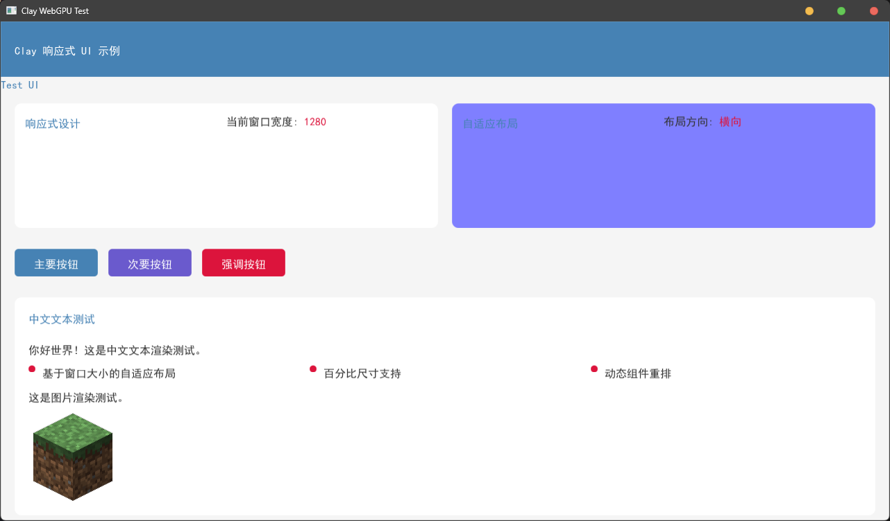
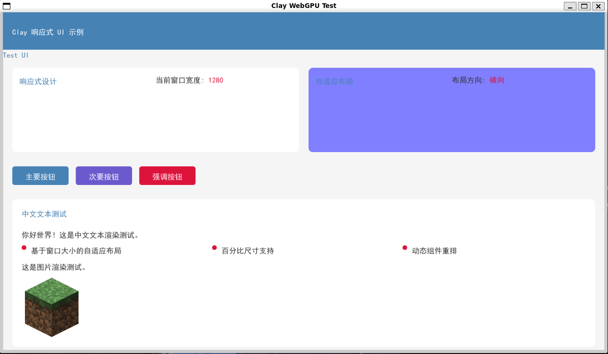

## 编译须知
1.你的电脑里面需要以下Include
> ps: clay.h 与 std_truetype.h已经内嵌到项目里面了，你不需要再下载了
 - **webgpu**: https://github.com/gfx-rs/wgpu-native
 - **GLFW**: https://www.glfw.org/
 - **clay.h**: https://github.com/nicbarker/clay
 - **std_truetype.h**: https://github.com/nothings/stb/blob/master/stb_truetype.h

---

2.你需要[zig 0.14.1 版本](https://ziglang.org/download/)环境用于编译

---

3.我为了方便有些东西直接使用了本地绝对路径，请按照自己的电脑环境进行修改以下文件
 - **.clangd**: 个人clangd配置文件，用于clangd做语法和第三方库检查
 - **build.zig**: 编译配置文件，我按照本人电脑编写了一些绝对路径以及引入了windows的一些相关路径
    如果你的系统不是windows，请根据自己的系统进行修改，~~虽然我有做不同平台处理，但是我没有测试过其他平台~~
 - **run.bat**: 个人用于编译和运行项目的批处理脚本

## 运行须知
1.在Windows大部分可直接运行
2.在Linux中需要安装Mesa库用于基本的图形渲染
  - 可选：Mesa默认使用llvmpipe运行，如果需要GPU渲染，请按照具体驱动
3.不支持在MacOS上运行，因为MacOS我没有设备测试QwQ

## 一些截图
- Windows

- Linux(WSL)
